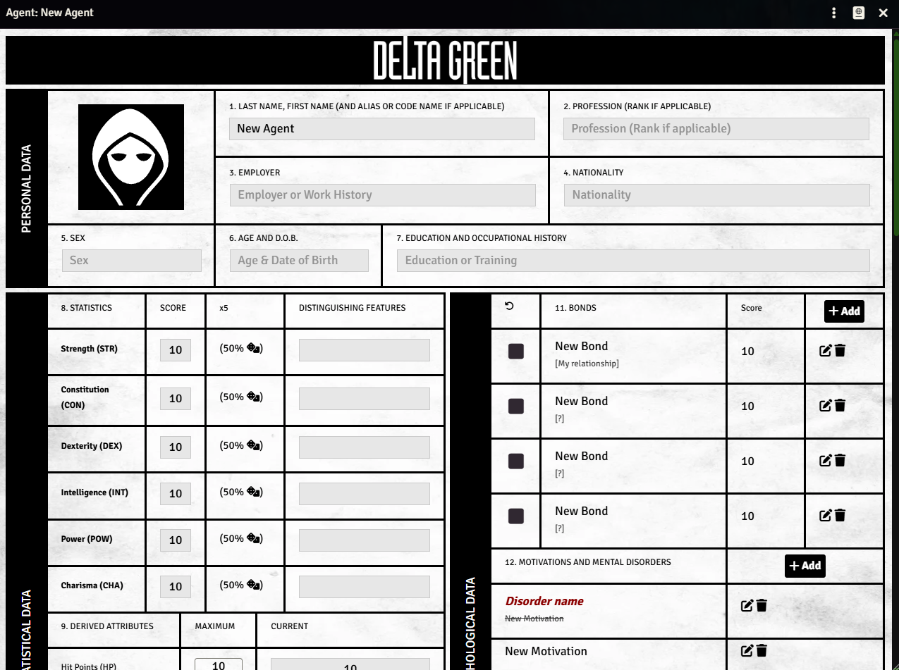
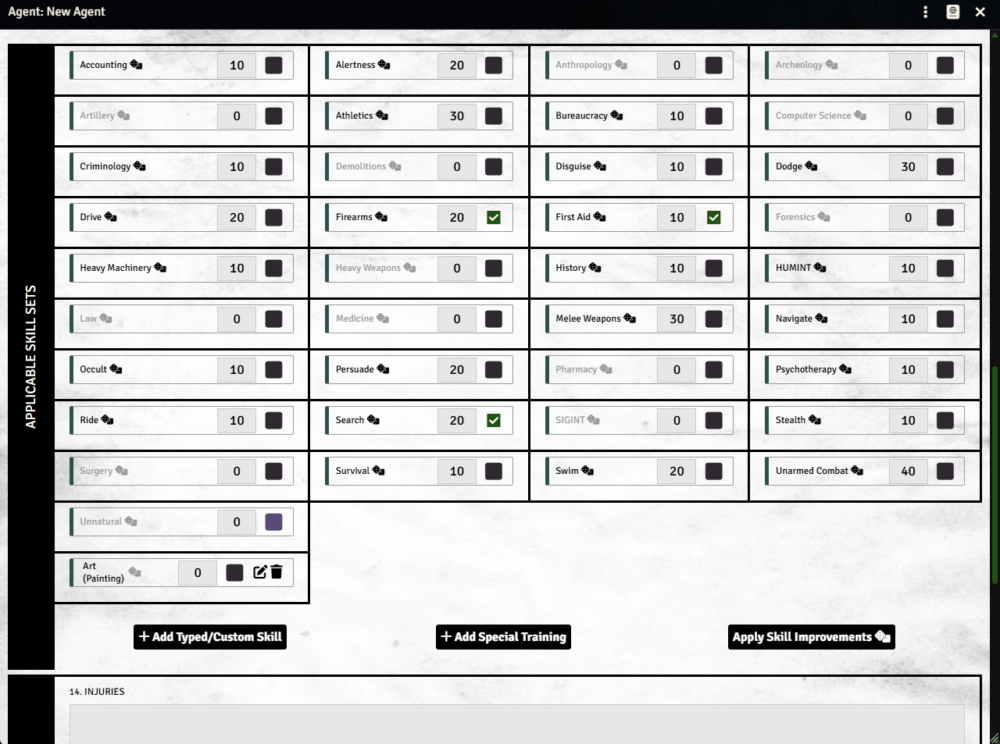

# Delta Green Book Style Character Sheet

A fan-made Foundry VTT module that provides a custom "book-style" character sheet for the Delta Green system, designed to replicate the original paper character sheet aesthetic with a crumpled paper background and authentic layout.

## Licensing

Published by arrangement with the Delta Green Partnership. The intellectual property known as Delta Green is a trademark and copyright owned by the Delta Green Parternship, who has licensed its use here.

The contents of this system are licensed under the terms of the MIT license, excepting those elements that are components of the Delta Green intellectual property.

## Features

### Visual Design
- **Authentic Paper Look**: Crumpled paper background texture for immersive character sheet experience
- **Book-Style Layout**: Recreates the original Delta Green character sheet design with numbered sections
- **Delta Green Branding**: Includes official Delta Green logo in the header
- **Visual adjustments**: Provides visual adjustments to some parts of the sheet (bonds, motivations, other gear)
- **Bilingual Support**: English and Polish language files included. You are welcome to submit any other language

## Screenshots

Here's how the book-style character sheet looks in action:


*Main character sheet view with book-style layout*


*Additional character sheet sections and features*

## Installation

### Method 1: Module Browser (Recommended)
1. Open Foundry VTT
2. Go to **Setup** → **Add-on Modules**
3. Click **Install Module**
4. Search for "Delta Green Book Style Character Sheet"
5. Click **Install** and **Enable**

### Method 2: Manual Installation
1. Download the module files
2. Place the `delta-green-book-style` folder in your Foundry VTT `Data/modules/` directory
3. Restart Foundry VTT
4. Enable the module in your world's module settings

## Setup

1. **Enable the Module**: In your world settings, ensure "Delta Green Book Style Character Sheet" is enabled
2. **Configure Sheet Style**: 
   - Go to **Configure Settings** → **Delta Green**
   - Set **Character Sheet Style** to "Book Style (Original)"
3. The new sheet style will automatically apply to Agent characters

## Usage

### Switching to Book Style
- The module adds "Book Style (Original)" as an option in the Delta Green system's character sheet style setting
- Once enabled, all Agent character sheets will use the new book-style layout
- The setting can be changed at any time and will update all open character sheets


## Compatibility

- **Foundry VTT**: Version 13.0 or higher
- **Delta Green System**: Version 1.6.1 or higher
- **Languages**: English, Polish

## Assets

The module includes several custom assets:
- `CrumpledPlainPaper10.webp`: Background texture for the book-style sheet
- `Delta_Green_Logo.webp`: Official Delta Green logo
- `dg_logo.webp`: Alternative Delta Green logo used in the header

## Technical Details

### Module Structure
```
delta-green-book-style/
├── assets/          # Images and textures
├── lang/            # Language files (en.json, pl.json)
├── scripts/         # JavaScript functionality
├── styles/          # CSS styling
├── templates/       # Template files
└── module.json      # Module configuration
```

### Key Components
- **Custom Sheet Class**: Extends the base Delta Green Agent sheet
- **Handlebars Helpers**: Custom helpers for sorting, calculations, and formatting
- **CSS Styling**: Comprehensive styling for the book aesthetic
- **Item Action Handlers**: Custom logic for item creation and management


## Contributing

This module is designed to enhance the Delta Green experience in Foundry VTT. If you encounter issues or have suggestions for improvements, please report them through the github. You are also welcome to push your changes as the PR to the repository.

## License

This module is created for use with the Delta Green roleplaying game and Foundry VTT. Please respect the intellectual property of both.

---

**Author**: Budzyn  
**Version**: 1.0.0  
**For**: Foundry VTT + Delta Green System
